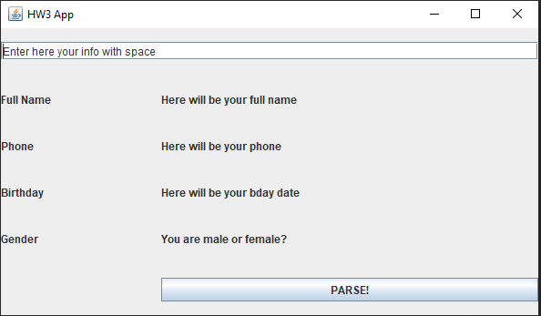
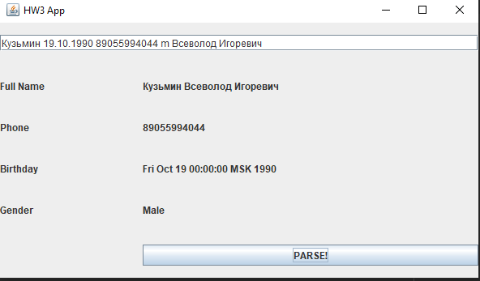
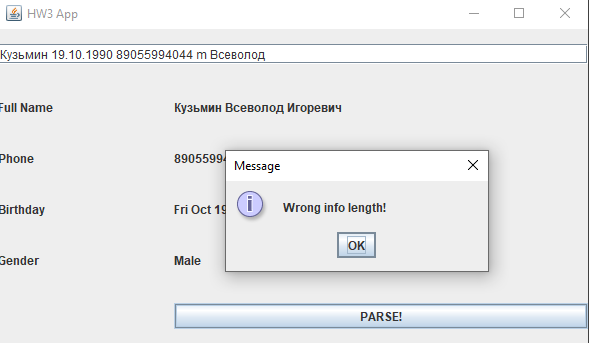
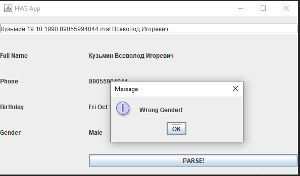
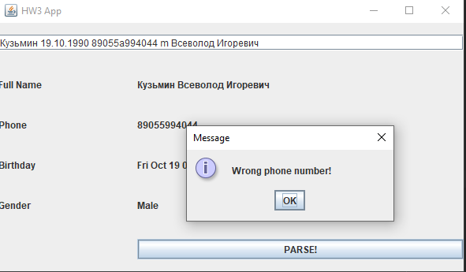
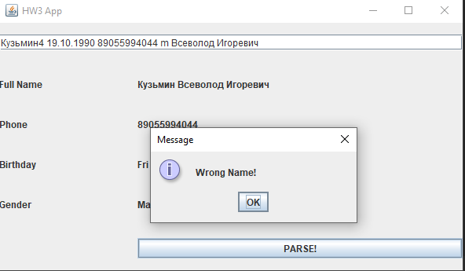

# Краткое описание приложения:
## 1) Вся логика, в т.ч и исключения лежат в папке Application, файл Program просто запускает программу 

## 2) Базовый вид приложения:

### а) Если все забито правильно, показывает следующее:

Вносить данные можно в любом порядке

## 3) Ошибки
### Если внесено мало данных

### Плохо указан пол

### Ошибка в телефоне

### Неправильный ДР

### Непраильное имя
